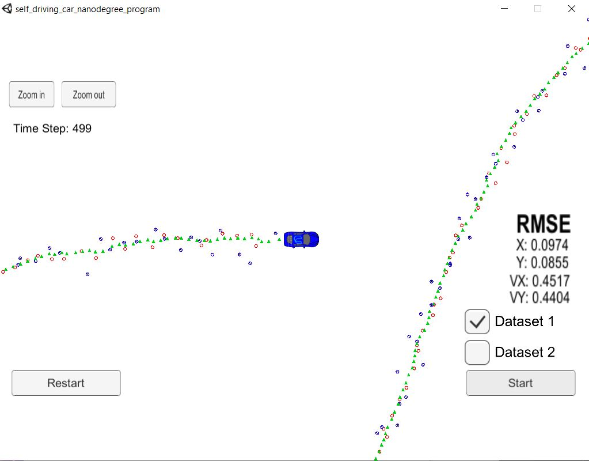
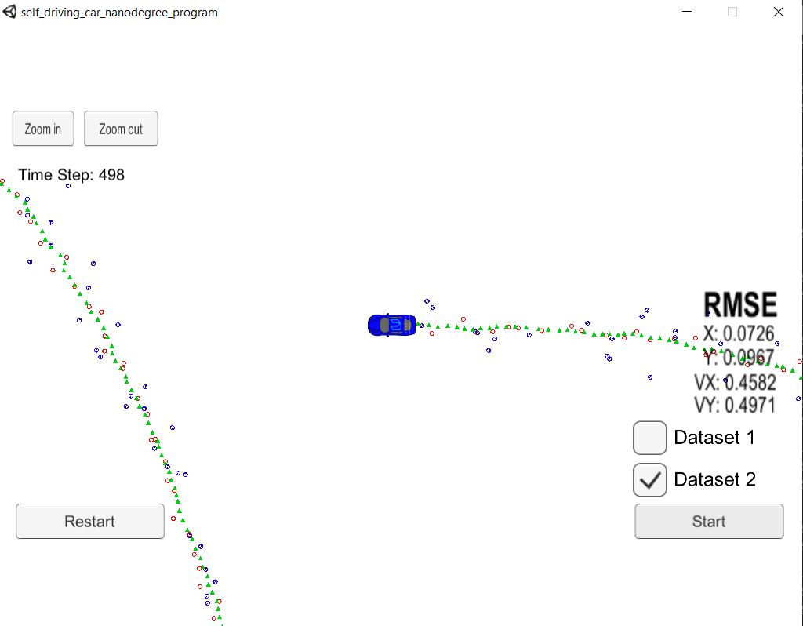

# Project: Extended Kalman Filter

Root Mean Squared Error (RMSE) evaluating the Extended Kalman Filter's performance on tracking an object's position and velocity from the car for **Dataset1** in the simulator:

Dataset1 starts with lidar, then alternates to radar and does this alternation until reaching end of the simulation.

Overview
---

The purpose of this project is to use an **Extended Kalman Filter (EKF)** to estimate the state of a moving object of interest, such as a bicycle, with noisy lidar and radar measurements. We were given existing code infrastructure for the EKF project that already had code written to communicate with a Udacity's Unity simulator client from our C++ program that acted as a web server. This communication allowed for extracting the client's sensor data. Our job was to write the sensor fusion flow (data pipeline) to perform initializations, predictions and updates on the sensor measurement data. To build this part of the data pipeline required background knowledge of differential equations and linear algebra because math equations for computing the predicted step and measurement update step were required. The update step was different for lidar and radar. With lidar, we could use the standard Kalman Filter equations because lidar has linear data. However, for radar, we needed to use the EKF equations because we were dealing with radar's nonlinear data. Finally, once the state's position and velocity data was processed, it was compared with the ground truth state to calculate the RMSE for tracking an object's position and velocity from the car. When the C++ program was executed and the simulator was launched, the C++ program would load the RMSE into the simulator. The simulator would display the RMSE as it was running. The RMSE had to meet Udacity's project rubric specifications [px, py, vx, vy] = [0.11, 0.11, 0.52, 0.52].

Contents
---

- **[src](src/)**: contains source code for the project
- **[src/main.cpp](src/main.cpp)**: main file is executed after running **./ExtendedKF** program. main.cpp acts a web server that reads radar or lidar data from the simulator client. main.cpp then calls on **ProcessMeasurement()**, located in **[FusionEKF.cpp](src/FusionEKF.cpp)** file, to run the sensor fusion data flow. This flow initializes the EKF variables, performs a prediction and measurement update step to track the object's state, position and velocity. The predict and update steps are defined in the **[kalman_filter.cpp](src/kalman_filter.cpp)**. Finally, main.cpp calls **CalculateRMSE()**, located in **[tools.cpp](src/tools.cpp)**, to calculate the error between the estimated state and ground truth state.
- **[Docs](Docs)**: contains images, txt files that describe the simulated sensor data, and later will have a writeup discussing how I implemented the EKF for sensor fusion (lidar, radar)
- **[ide_profiles](ide_profiles)**: contains folders to import the code into Eclipse or xcode. You could also open the project from base in a text editor of your choice, such as MS Visual Studio Code or Atom
- **[CMakeLists.txt](CMakeLists.txt)**: contains directives and instructions describing the project's source files and targets (executable, library, or both). It is a build configuration file that cmake uses to generate makefiles. Then the make command is used to manage compiling the project, use a compiler to compile the program and generate executables. In our case, we retrieve the **ExtendedKF** executable file, machine language, that runs the c++ program directly on the computer.
- **[install-linux.sh](install-linux.sh)**: contains bash code to install the tools necessary to run the EKF project on linux. This linux script can be run inside Windows 10 Bash on Ubuntu. There is a similar install script for mac.
- **README.md(README.md)**: provides overview of the project and how to set it up

Dependencies
---

This project requires the **Term 2 Simulator**, which can be downloaded from this [GitHub link](https://github.com/udacity/self-driving-car-sim/releases).

* cmake >= 3.5
  * All OSes: [click here for installation instructions](https://cmake.org/install/)
* make >= 4.1 (Linux, Mac), 3.81 (Windows)
  * Linux: make is installed by default on most Linux distros
  * Mac: [install Xcode command line tools to get make](https://developer.apple.com/xcode/features/)
  * Windows: [Click here for installation instructions](http://gnuwin32.sourceforge.net/packages/make.htm)
* gcc/g++ >= 5.4
  * Linux: gcc / g++ is installed by default on most Linux distros
  * Mac: same deal as make - [install Xcode command line tools](https://developer.apple.com/xcode/features/)
  * Windows: recommend using [MinGW](http://www.mingw.org/)

How to Run the Demo
---

### Build & Compile the EKF C++ Program

Open your terminal ([Windows 10 Ubuntu Bash Shell](), Linux Shell, Mac OS X Shell), then clone a copy of the project onto your computer:

~~~
git clone https://github.com/james94/P5-Extended-Kalman-Filter-CarND
~~~

This project requires using open source package **[uWebSocketIO](https://github.com/uNetworking/uWebSockets)**. This package facilitates the connection between the simulator and C++ code used in this EKF project by setting up a web socket server connection from the C++ program to the simulator. The C++ program software is a web server and the simulator is a client. There are two scripts for installing **uWebSocketIO** - one for Linux and the other for macOS. 

Run the shell script below to install **uWebSocketIO**, build and compile the C++ EKF program:

~~~bash
cd P5-Extended-Kalman-Filter-CarND
# Linux or Windows 10 Ubuntu (18.04) Bash Shell
./install-ubuntu.sh

# Mac OS X Shell
./install-mac.sh
~~~

> **WARNING**: for the above shell script, choose the one appropriate for your OS

At the end of the install script, the **make** build automation tool uses the compiler to compile the project and the following executable program **ExtendedKF** will be generated in the **build** folder. Run the EKF program with the command below:

~~~bash
./ExtendedKF
~~~

Let's say you make updates to the C++ EKF program, all we need to do is rerun the build and compile commands using the shell commands below:

~~~bash
cd P5-Extended-Kalman-Filter-CarND
mkdir build
cd build
cmake .. && make
~~~

Rerun the EKF program with the command below:

~~~bash
./ExtendedKF
~~~

The output you will receive in your terminal:

~~~bash
Listening to port 4567
~~~

Now we need to finish connecting the C++ program to the simulator.

### Launch the Simulator and Connect the C++ Program

Go to the folder where  you downloaded **Term 2 Simulator**, decompress the **term2_sim_{your_OS}** and double click on **term2_sim** to launch the program.

Click **Play!**. Select **Project 1/2: EKF  and UKF**.

Now referring back to your terminal, you should see an update:

~~~bash
Listening to port 4567
Connected!!!
~~~

Now the simulator and the C++ program are connected. 

### Report RMSE for Tracking Position and Velocity

Head back to the simulator, select **Dataset 1** or **Dataset 2**, then press **Start**. 

What will happen now is that data alternating between lidar and radar is sent to the C++ program, EKF calculations are performed to retrieve RMSE in order to evaluate EKF performance with tracking an object's position and velocity from the car for **Dataset X** in the simulator.

What you should see in the **simulator client** if you selected **Dataset 2**:

Dataset2 is a reversed version of Dataset1, it starts with radar, then alternates to lidar and does this alternation until reaching end of the simulation.

What you should see in the **terminal server** if you selected **Dataset 2** in your simulator client:

~~~bash
Listening to port 4567
Connected!!!
~~~

The terminal can be a good place to see your debug (ex: cout) statements for when you are debugging the C++ EKF program.

Once the simulation ends, to safely close the C++ program from your terminal, press `ctrl+c`. Then to reopen the C++ program, `./ExtendedKF`. This procedure refreshes the Kalman Filter. You should do this procedure when trying to run a different data set or running the same data set multiple times in a row. Otherwise, the RMSE values will become large because the previous different filter results are still being observed in memory. 

You should see the shell output after safely closing the C++ program:

~~~bash
Listening to port 4567
Connected!!!
^C
~~~

### Summary

Congratulations, that is it for this project. You just ran the demo for an Extended Kalman Filter C++ program with a Unity simulator. We saw RMSE reporting in the simulator to tell us how well our Extended Kalman Filter performed with tracking an object's position and velocity from a car. When testing **Dataset 1**, we saw that **RMSE** reached `[0.0974, 0.0855, 0.4517, 0.4404]` for evaluating EKF performance during the simulation. Similarly, when testing **Dataset 2**, we saw that **RMSE** reached `[0.0726, 0.0967, 0.4582, 0.4971]` for evaluating EKF performance during the simulation.

If you are interested in knowing more about the input and output data communication between the simulator client and C++ program software server, refer to the next section. If you are interested in learning more about the coding style used for this project, refer to **Coding Style** section below.

### Input and Output Data Between Client and Server 

Here is the main protocol that main.cpp uses for uWebSocketIO in communicating with the simulator.

**INPUT**: values provided by the simulator client to the c++ program software server

["sensor_measurement"] => the measurement that the simulator observed (either lidar or radar)

**OUTPUT**: values provided by the c++ program software server to the simulator client

["estimate_x"] <= kalman filter estimated position x

["estimate_y"] <= kalman filter estimated position y

["rmse_x"] <= root mean squared error position x

["rmse_y"] <= root mean squared error position y

["rmse_vx"] <= root mean squared error velocity x

["rmse_vy"] <= root mean squared error velocity y

---

## Code Style

Please (do your best to) stick to [Google's C++ style guide](https://google.github.io/styleguide/cppguide.html).

## Programs Written To Accomplish Project

- **[FusionEKF.cpp](src/FusionEKF.cpp)**: sensor fusion flow receives simulator client data from main.cpp, handles lidar or radar data prediction and measurement update steps and updates the state estimate position and velocity for main.cpp
- **[src/FusionEKF.h](src/FusionEKF.h)**
- **[kalman_filter.cpp](src/kalman_filter.cpp)**: defines the algorithms (Predict(), Update(), UpdateEKF()) for prediction and measurement update steps for lidar and radar
- **[kalman_filter.h](src/kalman_filter.h)**
- **[tools.cpp](src/tools.cpp)**: defines root mean squared error calculation for main.cpp and  jacobian computation for FusionEKF.cpp
- **[tools.h](src/tools.h)**
